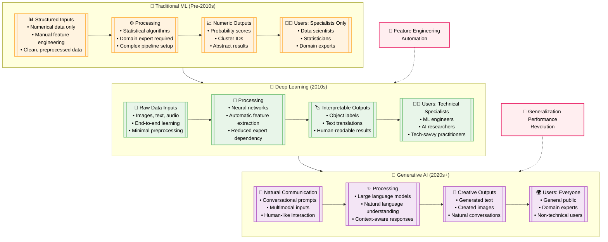

# Evolution of AI Interaction Modes: Mermaid Diagram

## Key Insights from the Evolution

### 📊 Traditional ML Era (Pre-2010s)
- **Interaction Mode**: Highly structured, numerical inputs only
- **Barriers**: Extensive feature engineering, domain expertise required
- **Output**: Abstract numerical results requiring interpretation
- **Accessibility**: Limited to specialists with statistical background

### 🧠 Deep Learning Revolution (2010s)  
- **Interaction Mode**: Direct raw data processing (images, text, audio)
- **Breakthrough**: Automatic feature extraction, end-to-end learning
- **Output**: Human-interpretable labels and predictions
- **Accessibility**: Expanded to technical practitioners and ML engineers

### 🤖 Generative AI Era (2020s+)
- **Interaction Mode**: Natural language conversation and multimodal communication
- **Revolution**: Human-like interaction, no technical expertise required
- **Output**: Creative content generation, conversational responses
- **Accessibility**: Democratized to general public and domain experts

## Impact on Industries

The research report highlights the **design industry** as a prime example:
- Traditional ML: Limited impact due to inability to handle creative, visual tasks
- Deep Learning: Some progress with image recognition and analysis
- Generative AI: **Revolutionary change** - designers can now collaborate with AI using natural language prompts to generate images, concepts, and variations

> *"57% of creative professionals say generative AI is the most disruptive force affecting the future of design"* - IBM/Oxford Survey

## The Democratization Effect

Each era has progressively lowered barriers:
1. **Traditional ML**: "Substantial learning curve and skilled team effort"
2. **Deep Learning**: Reduced feature engineering but still required technical skills  
3. **Generative AI**: "Human-like natural language input makes it accessible to everyone"

This evolution represents AI learning to "speak" in increasingly human terms, from numbers and rigid structures to natural conversation and creative collaboration.